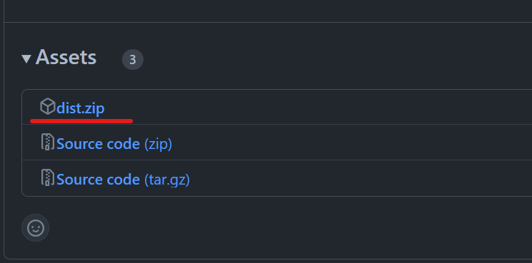
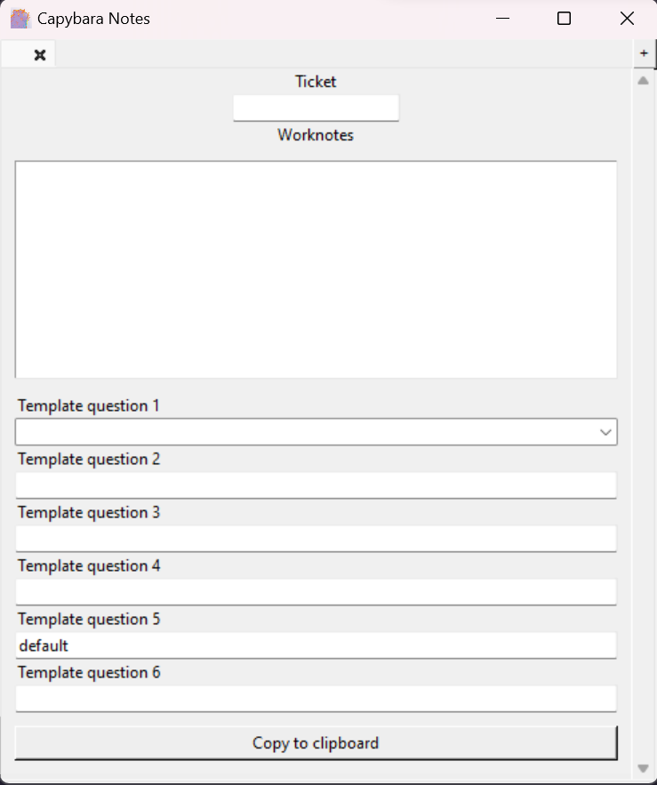
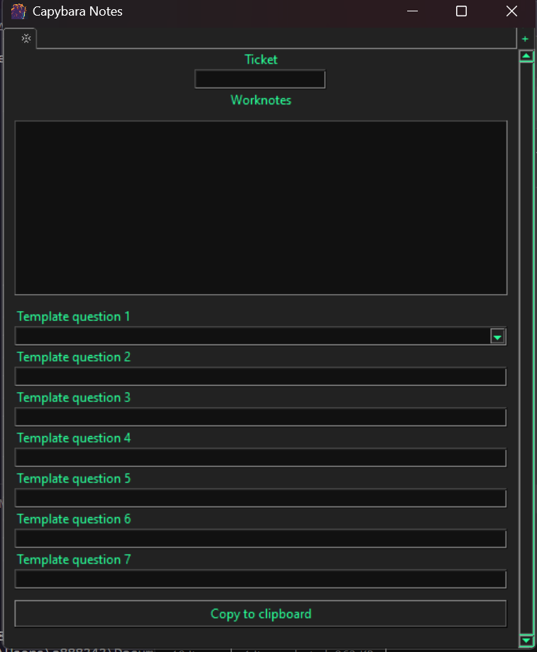

# Welcome to Capybara Notes 

Capybara Notes is a simple app to assist with filling Minimum Data Set (MDS) templates

With Capybara Notes you can quickly fill your template and copy it to clipboard formatted and ready to use

# How to get started

To start using the app all you need is to go in releases

click "dist.zip" file in the latest release to download the zip with the app

After downloading the zip, extract the file anywhere you want and it is now ready to use, all you need to do is run the .exe

To find the app with windows search you can create a shortcut on desktop for the .exe, after running it once it should now show up when searching for the name of the shortcut on windows search

# How to customize your notes app

The app customization settings can all be found in the config.json file in the same folder where you found the .exe

In your config.json you can change the app configurations and change the questions for your MDS template

- "app-name" changes the name that shows on the application title bar
- "icon-path" is the path to the icon that will show up on the title bar
- "worknotes-lbl" is the label for the work notes section (the section with the multi-line textbox)
- "copy-btn-lbl" is the text on the button to copy the notes
- "worknotes-height" is the height of the work notes
- "worknotes-style" is the bullet point on each work note line
- "list-style" is the same but for each question
- "line-separator-style" is the patters that will shows around the ticket name on the final work notes
- "worknotes-below" puts the work notes below the mds questions

## Themes

In themes you can customize the application colors

    
    

 

- "theme" you can change it to a theme on your OS like: default, clam and vista, or use a custom one by changing the theme name to one that is not being used, this will use the colors that you choose in the following settings
- "dark-window" toggles the title bar between it's light and dark mode
- "bg-color" main background color
- "field-color" background color for the text fields
- "text-color" color for the text
- "highlight" color for the text selection

- "font-family": font family of the text on the app
- "font-size": font size of text
- "save-folder-path": folder path where the notes will be saved

## Template questions 

In "questions" you can change the mds questions according to the template you use

- "question" is the question text
- "default" is the default value, if there is only one default option it is filled automatically and if there is more than one they are displayed as a combobox

## Shortcuts

- Ctrl + n & Ctrl + t: open new tab
- Ctrl + w: close current tab
- Ctrl + s: copy to clipboard and save
- Ctrl + page up/down: move between tabs

====================================================

Capybara neon AI generated Image by rawpixel.com
